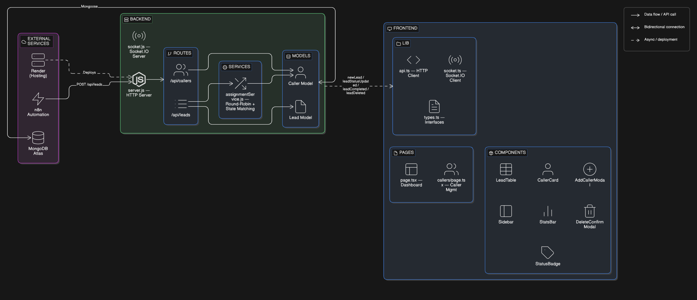
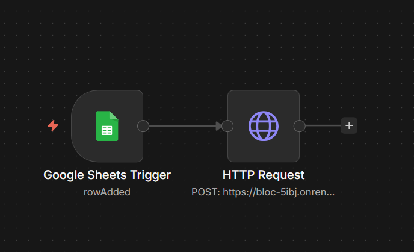

<p align="center">
  <h1 align="center">Bloc</h1>
  <p align="center">Real-time lead distribution &amp; management platform for telecalling operations</p>
</p>

<p align="center">
  
  
  
  
  
</p>

---

## Table of Contents

- [System Architecture](#system-architecture)
- [How It Works — Development Logic](#how-it-works--development-logic)
- [Data Structures](#data-structures)
- [Automation Workflow](#automation-workflow)
- [How Automation Is Triggered](#how-automation-is-triggered)
- [Setup Instructions](#setup-instructions)
- [What I'd Improve With More Time](#what-id-improve-with-more-time)

---

## System Architecture



The platform is split into three independently deployable layers:

- **External Services** — n8n automation (webhook-based ingestion), Render (hosting), MongoDB Atlas (persistence).
- **Backend (Express.js)** — An HTTP server that exposes RESTful routes for leads and callers. A Socket.IO server is co-located on the same process to push real-time events (`newLead`, `leadStatusUpdated`, `leadCompleted`, `leadDeleted`) to every connected dashboard client. An internal assignment service sits between the routes and the database, handling the round-robin distribution logic.
- **Frontend (Next.js + TypeScript)** — A two-page admin dashboard. The dashboard page renders a live lead feed with inline status actions. The callers page manages the team roster. Both pages subscribe to Socket.IO events, so every status change or new lead animates in without polling or page refreshes.

---

## How It Works — Development Logic

### Lead Ingestion & Auto-Assignment

When a lead hits `POST /api/leads`, the backend doesn't just save it — it runs the **assignment engine** first:

1. **Fetch all callers** from the database.
2. **State match** — if the lead has a `state` field, filter callers to those whose `assignedStates` array includes that state. If no match, fall back to the full pool.
3. **Daily reset** — for each caller in the pool, check if `lastResetDate` is today. If not, reset `todayAssignedCount` to 0.
4. **Limit check** — remove any caller whose `todayAssignedCount` has reached their `dailyLimit` (0 means unlimited).
5. **Round-robin** — sort remaining callers by `lastAssignedAt` ascending (nulls first), pick the one who was assigned a lead *least recently*.
6. **Assign** — increment the selected caller's counter, save, and attach the caller's ID to the lead.

The saved lead is then populated with the caller's name and broadcast to all connected clients via Socket.IO's `newLead` event.

### Status Lifecycle

Leads follow a defined status flow:

```
pending → calling → completed / no-answer / failed
```

- **`pending`** — lead just arrived, not yet being actioned.
- **`calling`** — a caller has picked up this lead.
- **`no-answer` / `failed`** — terminal states that keep the lead visible for review.
- **`completed`** — the lead is auto-deleted from the database and a `leadCompleted` event fires so all dashboards remove it in real time.

### Real-Time Event Flow

Every mutation that affects the dashboard emits a Socket.IO event:

| Mutation | Socket Event | Payload |
|---|---|---|
| New lead created | `newLead` | Full lead object |
| Status updated (non-completed) | `leadStatusUpdated` | Updated lead object |
| Status set to `completed` | `leadCompleted` | `{ leadId }` |
| Manual delete | `leadDeleted` | `{ leadId }` |

The frontend listens for these events and updates the React state directly — no re-fetching required.

---

## Data Structures

### Lead

```js
{
  name:             String,        // required
  phone:            String,
  timestamp:        Date,
  leadSource:       String,        // e.g. "Facebook Ads", "Google Ads"
  city:             String,
  state:            String,        // used for geographic caller matching
  status:           String,        // enum: pending | calling | completed | no-answer | failed
  assignedCallerId: ObjectId,      // ref → Caller (populated as { _id, name })
  assignedAt:       Date,
  createdAt:        Date,          // auto
  updatedAt:        Date           // auto
}
```

### Caller

```js
{
  name:               String,      // required
  role:               String,      // e.g. "Senior Agent", "Team Lead"
  languages:          [String],    // e.g. ["English", "Hindi"]
  assignedStates:     [String],    // e.g. ["Maharashtra", "Gujarat"]
  dailyLimit:         Number,      // 0 = unlimited
  todayAssignedCount: Number,      // auto-managed, resets daily
  lastAssignedAt:     Date,        // used for round-robin ordering
  lastResetDate:      Date,        // tracks daily counter reset
  createdAt:          Date,        // auto
  updatedAt:          Date         // auto
}
```

---

## Automation Workflow



The lead ingestion is fully automated using **n8n**, a workflow automation tool. The workflow is simple and intentional:

1. **Google Sheets Trigger** (`rowAdded`) — listens for new rows added to a Google Sheet. Each row represents a new lead with columns for name, phone, city, state, lead source, and timestamp.
2. **HTTP Request** (`POST`) — takes the row data and sends it as a JSON payload to the backend's `POST /api/leads` endpoint on Render.

That's it. No middleware, no queue. The moment a row lands in the sheet, n8n fires the webhook, the backend assigns the lead, saves it, and pushes a real-time event to every open dashboard.

---

## How Automation Is Triggered

The end-to-end flow works like this:

```
Lead fills a form (Google Form / Ad Platform)
        ↓
Row is appended to a Google Sheet
        ↓
n8n detects the new row (Google Sheets Trigger — polling)
        ↓
n8n sends POST /api/leads with the lead data
        ↓
Backend runs assignment algorithm → picks best-fit caller
        ↓
Lead is saved to MongoDB with caller reference
        ↓
Socket.IO emits "newLead" event
        ↓
All connected dashboards render the lead instantly
```

The trigger is **event-driven from n8n's perspective** — it polls the Google Sheet for new rows at a configured interval. Once a new row is detected, the HTTP request fires immediately. No human intervention is needed at any point in the pipeline.

---

## Setup Instructions

### Prerequisites

- Node.js ≥ 18
- MongoDB Atlas cluster (or local MongoDB)
- n8n instance (optional, for automation)

### Backend

```bash
cd backend
npm install
```

Create a `.env` file:

```env
MONGO_URI=your_mongodb_connection_string
PORT=5000
```

Start the server:

```bash
npm run dev
```

The API will be live at `http://localhost:5000`. Health check: `GET /`.

### Frontend

```bash
cd frontend
npm install
```

Optionally override the API URL in `.env.local`:

```env
NEXT_PUBLIC_API_URL=http://localhost:5000
```

Start the dev server:

```bash
npm run dev
```

Dashboard will be at `http://localhost:3000`.

### Deployment

The backend is pre-configured for **Render**:

- Binds to `0.0.0.0`
- Health check responds at `GET /`
- Start command: `node server.js`

Set `MONGO_URI` in your Render environment variables and deploy.

---

## What I'd Improve With More Time

- **Authentication & role-based access** — add JWT-based auth so only admins can manage callers and only assigned callers can update their own leads. Currently the API is open.
- **Soft delete + audit log** — instead of hard-deleting completed leads, archive them to a separate collection with full status history for analytics and reporting.
- **Lead priority scoring** — weight leads by source quality, response time, and geographic proximity to the caller, rather than pure round-robin.
- **Caller availability status** — let callers mark themselves as online/offline/break so the assignment engine skips unavailable agents.
- **Dashboard analytics page** — add charts for conversion rates, average call duration, leads per source, caller performance over time.
- **Queue-based ingestion** — replace the direct HTTP call from n8n with a message queue (Redis/BullMQ) to handle lead bursts without dropping requests.
- **Mobile-responsive caller app** — a lightweight mobile view for callers to see their assigned leads and update statuses on the go.
- **Retry logic for failed leads** — auto-reschedule `no-answer` leads after a configurable cooldown, with a max retry count.
- **Rate limiting & input validation middleware** — add express-rate-limit and a validation layer (Joi/Zod) to harden the API against abuse.
- **CI/CD pipeline** — GitHub Actions for automated linting, testing, and deployment on push to main.
